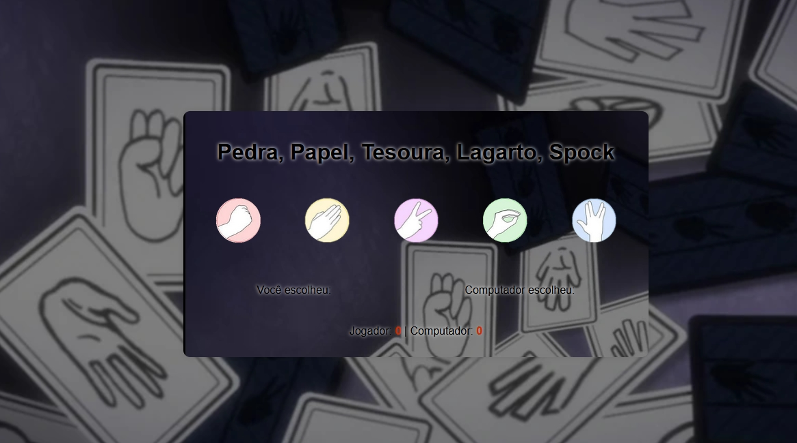
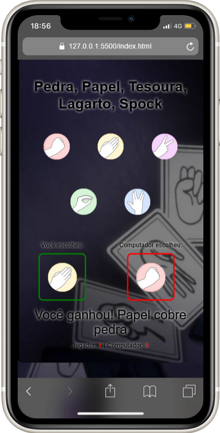


EN

This code creates a "Rock, Paper, Scissors, Lizard, Spock" game based on the TV series The Big Bang Theory, which aired from 2007 to 2019.

It features buttons that users can click to make their choice.

The result is displayed on the screen along with the player and computer scores. Images are used to represent each choice.

The rules of Rock-Paper-Scissors-Lizard-Spock are:

    Scissors cuts paper
    Paper covers rock
    Rock crushes lizard
    Lizard poisons Spock
    Spock smashes (or melts) scissors
    Scissors decapitates lizard
    Lizard eats paper
    Paper disproves Spock
    Spock vaporizes rock
    Rock crushes scissors

Developed by Thiago Torres.

---------------------------

PT-BR

Este código cria um jogo de "Pedra, Papel, Tesoura, Lagarto, Spock" baseiado no seriado de Tv "The Big Bang Theory" que foi ao ar de 2007 a 2019.

Ele possui botões que os usuários podem clicar para fazer sua escolha.

O resultado é mostrado na tela junto com a pontuação do jogador e do computador. As imagens são usadas para representar cada escolha.

As regras de Pedra-papel-tesoura-lagarto-Spock são:

    Tesoura corta papel
    Papel cobre pedra
    Pedra esmaga lagarto
    Lagarto envenena Spock
    Spock esmaga (ou derrete) tesoura
    Tesoura decapita lagarto
    Lagarto come papel
    Papel refuta Spock
    Spock vaporiza pedra
    Pedra amassa tesoura 

Desenvolvido por Thiago Torres.

[Linkedin](https://www.linkedin.com/in/thiago-f-torres/)

[Github](https://github.com/ThiagoTorresFerrao)

[Instagram](https://www.instagram.com/thiagotorresferrao/)

[YouTube](https://www.youtube.com/@Thiago_Torres)
